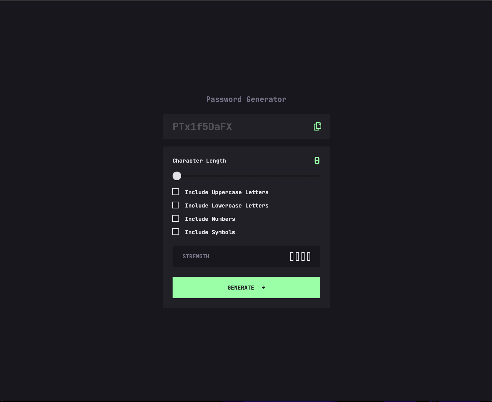
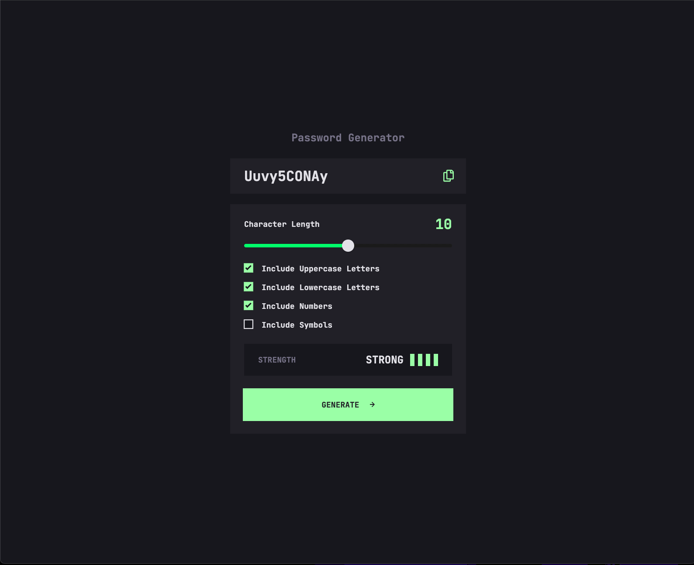

# Frontend Mentor - Password generator app solution

This is a solution to the [Password generator app challenge on Frontend Mentor](https://www.frontendmentor.io/challenges/password-generator-app-Mr8CLycqjh). Frontend Mentor challenges help you improve your coding skills by building realistic projects.

## Table of contents

- [Overview](#overview)
  - [The challenge](#the-challenge)
  - [Screenshot](#screenshot)
  - [Links](#links)
- [My process](#my-process)
  - [Built with](#built-with)
  - [What I learned](#what-i-learned)
  - [Continued development](#continued-development)
  - [Useful resources](#useful-resources)
- [Author](#author)

## Overview

### The challenge

Users should be able to:

- Generate a password based on the selected inclusion options
- Copy the generated password to the computer's clipboard
- See a strength rating for their generated password
- View the optimal layout for the interface depending on their device's screen size
- See hover and focus states for all interactive elements on the page

### Screenshot




### Links

- Solution URL: [Solution URL here](https://github.com/hectorlil48/password-generator-app)
- Live Site URL: [Live site URL here](https://hectorlil48.github.io/password-generator-app/)

## My process

### Built with

- Semantic HTML5 markup
- CSS custom properties
- Flexbox
- CSS Grid
- JavaScript
- Dom

### What I learned

Working on the Random Password Generator project helped me strengthen my understanding of JavaScript and UI design principles:

- Generating Randomized Content with JavaScript
  I learned how to create random strings dynamically by combining character sets and iterating through them. This allowed me to customize password generation based on user-selected criteria.

```js
const lowercase = "abcdefghijklmnopqrstuvwxyz";
const uppercase = "ABCDEFGHIJKLMNOPQRSTUVWXYZ";
const numbers = "0123456789";
const specialChars = "!@#$%^&*()_+[]{}|;:,.<>?";

let characterPool = "";
if (includeUppercase) characterPool += uppercase;
if (includeLowercase) characterPool += lowercase;
if (includeNumbers) characterPool += numbers;
if (includeSymbols) characterPool += specialChars;

let password = "";
for (let i = 0; i < length; i++) {
  password += getRandomChar(characterPool);
}
```

- Creating a Password Strength Meter
  I built a password strength meter using JavaScript and dynamically updated its visual feedback with CSS. This feature provided users with real-time guidance on the strength of their passwords.

```js
// Reset all boxes to default styles
boxes.forEach((box) => {
  box.style.backgroundColor = "transparent";
  box.style.border = `2px solid ${whiteColor}`; // Default border
});
// Set the color for boxes based on the strength
for (let i = 0; i < boxes.length; i++) {
  if (i < strength) {
    if (strength === 1) {
      boxes[i].style.backgroundColor = redColor;
    } else if (strength === 2) {
      boxes[i].style.backgroundColor = orangeColor;
    } else if (strength === 3) {
      boxes[i].style.backgroundColor = yellowColor;
    } else if (strength >= 4) {
      boxes[i].style.backgroundColor = greenColor;
    }
    boxes[i].style.border = "none"; // Remove border for active boxes
  } else {
    boxes[i].style.backgroundColor = "transparent"; // Reset the inactive boxes
  }
}

// Update the rating text based on strength
if (strength === 1) {
  rating.innerText = "too weak!";
} else if (strength === 2) {
  rating.innerText = "weak";
} else if (strength === 3) {
  rating.innerText = "medium";
} else if (strength >= 4) {
  rating.innerText = "strong";
}
```

This project not only solidified my JavaScript knowledge but also helped me understand how to implement intuitive UX/UI features that improve user interaction. I’m excited to carry these skills into future projects!

### Continued development

To further enhance the Random Password Generator project, I plan to focus on these areas for continued development:

- Improved User Interface and Accessibility

  - Add visually appealing transitions and animations for the strength meter and input fields to provide a more engaging user experience.
  - Include ARIA labels and keyboard navigation support to improve accessibility for all users.

- Secure Password Storage

  - Add functionality to securely copy the generated password to the clipboard with a single button click.
  - Integrate a feature for temporarily storing generated passwords locally with encryption for convenience during account creation.

- Mobile Optimization

  - Ensure the app is fully responsive on mobile devices, including easy-to-tap buttons and optimized layouts for smaller screens.
  - Create a Progressive Web App (PWA) version that users can install on their phones for offline access.

These enhancements will not only improve functionality and user experience but also align the project with professional development standards.

### Useful resources

- [ChatGPT](https://chatgpt.com/) - This tool was invaluable for brainstorming ideas, refining technical descriptions, and troubleshooting code efficiently. I appreciated how it provided clear examples and explanations tailored to my projects.
- [W3schools](https://www.w3schools.com/) - A go-to resource for understanding HTML, CSS, and JavaScript fundamentals. It provided quick and clear explanations for concepts like CSS grid, input validation, and responsive design. I particularly valued its interactive examples and references for quick lookups during development.

## Author

- GitHub - [Hector Ramirez](https://github.com/hectorlil48)
- Frontend Mentor - [@hectorlil48](https://www.frontendmentor.io/profile/hectorlil48)
- LinkedIn - [@linkedin.com/in/hector-ramirez-6a6509170](https://www.linkedin.com/in/hector-ramirez-6a6509170/overlay/contact-info/)
